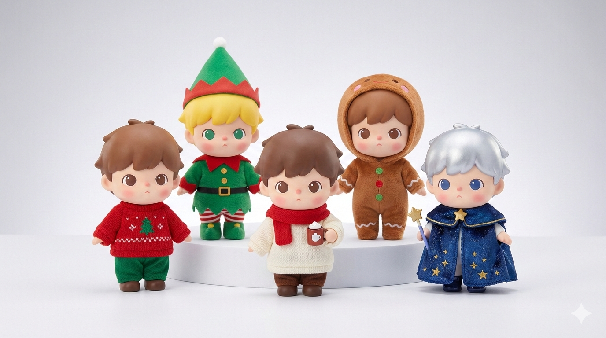
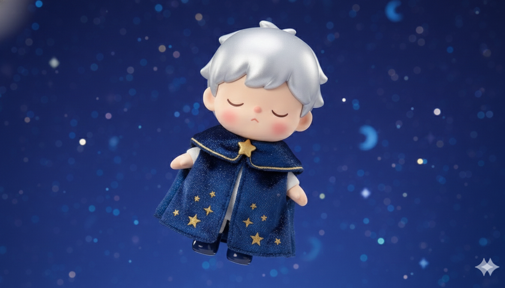
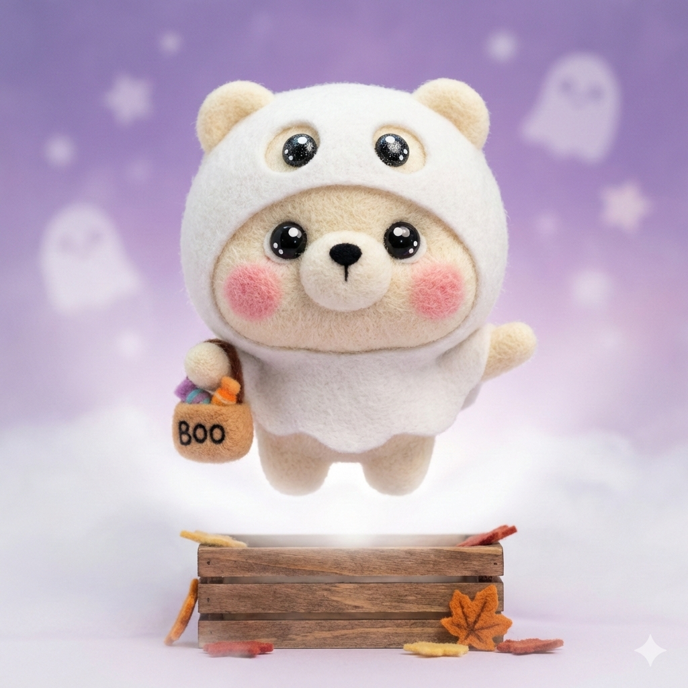

# designer-toy-skill

[English](./README.md) | 中文

**生成 Pop Mart 风格盲盒手办系列，确保角色设计一致性**

<table>
<tr>
<td width="50%" align="center">
<b>圣诞酷男孩</b><br/>
乙烯基毛绒风格<br/><br/>

</td>
<td width="50%" align="center">
<b>万圣节羊毛毡熊</b><br/>
羊毛毡风格<br/><br/>

</td>
</tr>
</table>

## 功能特点

| 功能 | 描述 |
|------|------|
| **角色一致性** | 确保群像和单人图之间特征完全一致 |
| **视觉参考法** | 使用群像作为参考来保持一致性 |
| **姿势多样性** | 坐姿、躺姿、漂浮姿势 - 不只是站立 |
| **丰富场景** | 完整的场景设计，包含灯光、背景、氛围 |
| **多种材质** | 乙烯基毛绒、羊毛毡等多种材质 |

---

## 快速开始

### 1. 安装

将文件复制到 Claude Code 技能目录：

```bash
mkdir -p ~/.claude/skills/designer-toy
cp SKILL.md ~/.claude/skills/designer-toy/
cp -r templates ~/.claude/skills/designer-toy/
```

### 2. 使用

在 Claude Code 中开始对话：

```
帮我设计一个圣诞主题的盲盒系列，包含5个角色
```

Claude 将引导你完成：
1. 创建角色锚点
2. 设计服装变体
3. 生成群像
4. 使用视觉参考创建单人图

---

## 工作流程

```
┌─────────────────┐    ┌─────────────────┐    ┌─────────────────┐
│  1. 角色锚点    │───▶│  2. 设计服装    │───▶│  3. 生成群像    │
└─────────────────┘    └─────────────────┘    └────────┬────────┘
                                                       │
┌─────────────────┐    ┌─────────────────┐    ┌────────▼────────┐
│  6. 一致性检查  │◀───│  5. 生成单人图  │◀───│  4. 位置映射    │
└─────────────────┘    └─────────────────┘    └─────────────────┘
```

| 阶段 | 描述 |
|------|------|
| **角色锚点** | 锁定基础特征：比例、脸型、眼睛、肤色 |
| **设计服装** | 创建服装锚点，包含颜色、图案、配饰 |
| **生成群像** | 创建包含所有角色的合集图 |
| **位置映射** | 记录每个角色的位置和特征 |
| **生成单人图** | 使用群像作为视觉参考生成每张单人图 |
| **一致性检查** | 验证发色、服装、比例是否匹配 |

---

## 示例：圣诞酷男孩系列

乙烯基毛绒风格盲盒系列，包含5个角色 + 1个隐藏款。

### 群像

<p align="center">

</p>

### 单人图（使用视觉参考法）

<table>
<tr>
<td align="center" width="20%">
<br/>
<b>圣诞毛衣</b><br/>
站立姿势
</td>
<td align="center" width="20%">
<br/>
<b>圣诞精灵</b><br/>
坐在礼物上
</td>
<td align="center" width="20%">
<br/>
<b>温暖冬日</b><br/>
雪天使姿势
</td>
<td align="center" width="20%">
<br/>
<b>姜饼人</b><br/>
躺姿
</td>
<td align="center" width="20%">
<br/>
<b>星空雪夜</b><br/>
漂浮姿势
</td>
</tr>
</table>

---

## 示例：万圣节羊毛毡熊系列

羊毛毡风格盲盒系列，包含5个角色 + 1个隐藏款。

### 群像

<p align="center">

</p>

### 单人图

<table>
<tr>
<td align="center" width="20%">
<br/>
<b>南瓜斗篷</b><br/>
站立姿势
</td>
<td align="center" width="20%">
<br/>
<b>小恶魔</b><br/>
单脚平衡
</td>
<td align="center" width="20%">
<br/>
<b>幽灵斗篷</b><br/>
漂浮姿势
</td>
<td align="center" width="20%">
<br/>
<b>小巫师</b><br/>
坐姿
</td>
<td align="center" width="20%">
<br/>
<b>骷髅</b><br/>
躺姿
</td>
</tr>
</table>

---

## 核心技术：视觉参考法

核心创新是在生成单人图时使用**群像作为视觉参考**。

### 为什么重要

| 问题 | 解决方案 |
|------|----------|
| 发色变化 | 直接参考群像 |
| 材质纹理不一致 | AI 看到精确的纹理来匹配 |
| 服装细节丢失 | 位置指示 + 视觉参考 |
| 比例漂移 | 锁定角色锚点 + 视觉检查 |

### 工作原理

生成每张单人图时：

1. **上传群像** 给 AI
2. **指定位置**："生成从左数第二个角色"
3. **描述特征**：发色、服装、姿势
4. **添加场景细节**：背景、灯光、氛围

---

## 姿势库

| 类别 | 姿势 | 关键词 |
|------|------|--------|
| **坐姿** | 盘腿坐 | `sitting cross-legged on floor` |
| | 坐在物体上 | `sitting on windowsill, legs dangling` |
| **躺姿** | 仰躺 | `lying on back, snow angel pose` |
| | 趴着 | `lying on stomach, chin in hands` |
| | 蜷缩 | `lying on side, curled up, sleepy` |
| **漂浮** | 悬浮 | `floating in air, dreamy` |
| **动态** | 单脚站立 | `standing on one leg, playful` |

---

## 兼容性

| 平台 | 状态 |
|------|------|
| Claude Code CLI | ✅ 支持 |
| Claude.ai | ✅ 支持（手动提示） |
| API | ✅ 支持 |

---

## 许可证

MIT 许可证 - 详见 [LICENSE](LICENSE)

---

<p align="center">
为设计师玩具爱好者用心制作 ❤️
</p>
