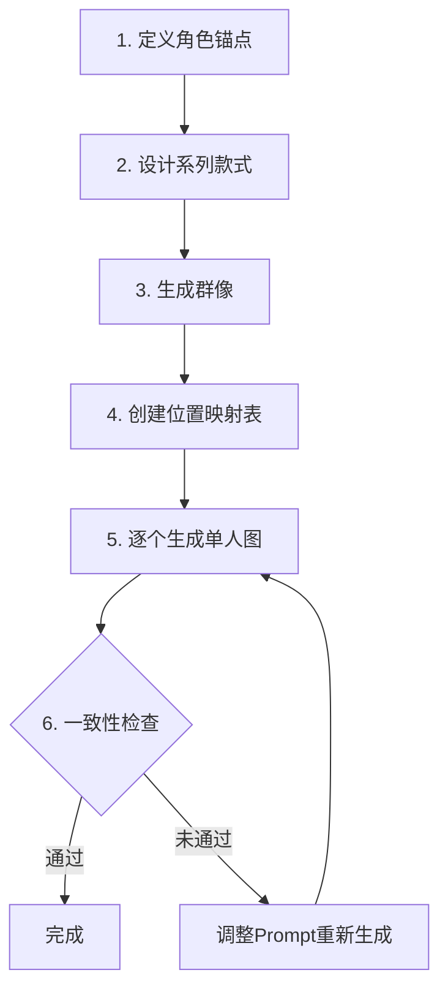

# Designer Toy 盲盒玩偶系列设计技能

## Overview

生成 Pop Mart 风格的设计师玩偶/盲盒系列。**核心能力**：
- **角色一致性保障**：确保群像和单人图中角色特征完全一致（发色、眼睛、比例）
- **姿势多样性**：避免全部站姿，提供坐/趴/躺/悬浮等丰富姿势
- **场景丰富度**：包含打光、背景、氛围的完整场景设计

## 工作流程



---

## 阶段 1：定义角色锚点 (CRITICAL)

> [!IMPORTANT]
> **必须**在所有图片生成中使用**完全相同**的角色锚点描述，否则会导致群像和单人图不一致！

### 角色锚点模板

为每个角色创建 `character-anchor.md` 文件：

```markdown
# Character Anchor - [角色名称]

## LOCKED Identity (所有图片必须保持一致)

### Base Foundation
Pop Mart style designer toy, vinyl figure collectible,
professional product photography, studio lighting,
chibi proportions, highly detailed collectible figure

### Proportions (LOCKED)
- Head-to-body ratio: [如 2.3:1]
- Head shape: [如 Round but not perfectly round]
- Body: [如 Slightly chubbier, approachable]

### Face (LOCKED)
- Shape: [具体描述]
- Expression base: [基础表情风格]

### Eyes (LOCKED)
- Size: [如 Large, 42% of face width]
- Shape: [如 Round with subtle upturn at corners]
- Pupils: [如 Large black with big highlights]
- Expression: [如 Curious but confident, dreamy cool]

### Skin (LOCKED)
- Tone: [颜色名 + Hex色号，如 Creamy fair #FFF5EE]
- Texture: [如 Smooth matte vinyl]

### Hair Color (可变但需明确声明)
- **发色变体表**:
  - 基础款: [颜色 + Hex，如 Warm brown #8B4513]
  - 精灵款: [颜色 + Hex，如 Golden blonde #F0C05A]
  - 隐藏款: [颜色 + Hex，如 Silver white #C0C0C0]

### Blush (LOCKED)
- Shape: [如 Small circular]
- Color: [颜色 + Hex，如 Soft pink #FFB0B0]
- Style: [如 Soft gradient edges]
```

---

## 阶段 2：设计系列款式

每个款式需要定义：
- 服装描述（**使用服装锚点！**）
- 表情变化
- 姿势（**必须多样化！**）
- 配件
- 场景/背景
- 打光风格

### 服装锚点系统 (CRITICAL)

> [!IMPORTANT]
> **必须**为每款服装创建锚点描述，群像和单人图都引用同一锚点，确保服装完全一致！

```markdown
# Outfit Anchor - [款式名称]

## LOCKED Outfit (群像和单人图必须完全一致)

### Main Garment
- Type: [服装类型，如 sweater, dress, costume]
- Color: [主色 + Hex，如 Red #C41E3A]
- Secondary color: [次色 + Hex，如 White #FFFFFF]
- Pattern: [图案描述，如 White snowflake pattern on chest]
- Material texture: [材质，如 Knitted texture, chunky yarn]

### Details (LOCKED)
- Collar/Neckline: [领口，如 Ribbed round collar]
- Sleeves: [袖子，如 Long sleeves with ribbed cuffs]
- Fit: [版型，如 Relaxed oversized fit]
- Special elements: [特殊元素，如 Small pompom at hem]

### Accessories (LOCKED)
- [配件1，如 Red santa hat with white fur trim]
- [配件2，如 Green striped scarf]
```

### 姿势多样性库 (避免全部站姿！)

| 分类 | 姿势类型 | Prompt关键词 | 适用场景 |
|-----|---------|-------------|---------|
| **坐姿** | 盘腿坐 | sitting cross-legged on floor | 温馨、休闲 |
| | 窗台坐 | sitting on windowsill, legs dangling | 梦幻、仰望 |
| | 靠坐 | leaning against, relaxed sitting | 慵懒、舒适 |
| **趴姿** | 托腮趴 | lying on stomach, chin in hands, feet up | 俏皮、可爱 |
| | 趴在物品上 | lying over [object], arms hanging | 慵懒、惬意 |
| **躺姿** | 仰躺 | lying on back, arms spread, snow angel pose | 欢乐、雪地 |
| | 侧躺 | lying on side, curled up | 睡眠、可爱 |
| **悬浮** | 漂浮 | floating in air, dreamy levitation | 魔法、梦境 |
| | 飞翔 | flying pose with cape flowing | 英雄、奇幻 |
| **动态站姿** | 单脚站 | standing on one leg, playful balance | 活泼、调皮 |
| | 跳跃 | jumping with joy, feet off ground | 欢乐 |
| **互动姿势** | 手持物品 | holding [item], looking at it lovingly | 故事感 |
| | 拥抱配件 | hugging [plush/item] | 温馨 |

### 产品形态扩展

| 形态 | Prompt关键词 | 特点 |
|-----|-------------|------|
| 盲盒玩偶 | vinyl figure, collectible toy, blind box figure | 标准立体人偶 |
| 毛绒挂件 | plush keychain, hanging charm, soft plush toy | 可爱软萌 |
| 坐墩 | chubby sitting bean bag pose, round bottom | 胖胖坐姿 |
| 亚克力立牌 | acrylic standee, flat illustration style, 2D art | 平面立牌 |

---

## 阶段 3：生成群像

### 群像场景设计原则 (CRITICAL)

> [!IMPORTANT]
> 群像需要有布景，但**不能喧宾夺主**！布景服务于主题，角色永远是视觉焦点。

#### 构图优先级（从前到后）
1. **前景角色** - 绝对主体，最高清晰度和饱和度
2. **地面/平台** - 承载角色，提供空间感
3. **中景道具** - 2-3个呼应主题的小道具，克制不堆砌
4. **远景氛围** - 虚化处理，烘托气氛

#### 背景处理技巧
| 技巧 | Prompt 关键词 | 作用 |
|-----|--------------|------|
| 景深虚化 | `soft bokeh background`, `blurred background elements` | 突出前景角色 |
| 色彩降级 | `desaturated background`, `muted background tones` | 避免背景抢眼 |
| 简化元素 | `minimal background props`, `subtle scene elements` | 避免杂乱 |
| 氛围光晕 | `soft ambient glow`, `dreamy atmosphere` | 增加层次感 |

### 群像 Prompt 结构

```markdown
## Collection Group Shot Prompt

### 1. Scene Setting (布景但不喧宾夺主)
Pop Mart blind box collection display, professional product photography,
[主题场景描述，如: cozy Halloween pumpkin patch setting],
soft gradient background with subtle [主题元素] silhouettes in bokeh,
foreground figures in sharp focus, background softly blurred,
desaturated background tones to emphasize characters

### 2. Platform/Ground (承载角色的平台)
[平台描述，如: wooden crate platform with scattered autumn leaves],
platform color complementing but not competing with figures

### 3. Arrangement
[数量] designer toys arranged in a group, varied heights and positions,
some standing, some sitting, natural grouping with breathing room

### 4. Characters (从左到右，每个必须完整描述，引用服装锚点)
- Left 1: [完整角色描述 + 发色 + 服装锚点内容]
- Left 2: [完整角色描述 + 发色 + 服装锚点内容]
- Center: [完整角色描述 + 发色 + 服装锚点内容]
- Right 2: [完整角色描述 + 发色 + 服装锚点内容]
- Right 1: [完整角色描述 + 发色 + 服装锚点内容]

### 5. Background Props (克制！2-3个即可)
- [道具1，如: carved pumpkin with soft glow, slightly out of focus]
- [道具2，如: small pile of candy corn, blurred in background]

### 6. Lighting (突出角色)
Product photography lighting, soft box lighting,
rim light for character separation from background,
[氛围打光，如: warm orange ambient glow from below]

### 7. Technical
High quality render, 4K, detailed [材质] texture,
depth of field with f/2.8 equivalent bokeh
```

---

## 阶段 4：创建位置映射表 (CRITICAL)

生成群像后，**立即**创建位置映射表，**必须引用服装锚点**：

| 群像位置 | 款式名称 | 毛色/发色 (精确) | 服装锚点引用 | 姿势 | 对应单人图 |
|---------|---------|-----------------|-------------|------|-----------|
| 左1 | 南瓜斗篷款 | 奶油棕 #D2B48C | → Outfit-01 | 站姿手持南瓜灯 | 01-pumpkin-cape.png |
| 左2 | 小恶魔款 | 焦糖棕 #8B4513 | → Outfit-02 | 单脚站俏皮 | 02-little-devil.png |
| 中 | 幽灵披风款 | 奶油棕 #D2B48C | → Outfit-03 | 悬浮飘动 | 03-ghost-cloak.png |
| 右2 | 巫师款 | 深巧克力 #3D2314 | → Outfit-04 | 坐姿翻魔法书 | 04-wizard.png |
| 右1 | 隐藏款-骷髅 | **月光白 #F5F5F5** | → Outfit-05 | 躺姿装死 | 05-hidden-skeleton.png |

---

## 阶段 5：逐个生成单人图

> [!IMPORTANT]
> **必须使用群像作为视觉参考！** 仅靠文字描述无法保证一致性，需要让 Gemini 直接看到群像中的角色形象。

### 单人图生成方法 (CRITICAL)

生成每张单人图时，**必须同时提供**：
1. **群像图片** - 作为视觉参考
2. **位置指示** - 明确指出是群像中的哪个角色
3. **文字 Prompt** - 补充场景和技术细节

### 单人图 Prompt 结构

```markdown
## Individual Figure Prompt

### 0. Visual Reference (CRITICAL - 必须包含！)
[附上群像图片 00-collection-group.png]

请参考上面的群像图片，为我生成其中 **[位置描述]** 的角色的单人特写图。

位置描述示例：
- "从左数第1个角色"
- "最右边的角色"
- "正中间的角色"
- "从右数第2个角色（穿紫色巫师袍的那个）"

这个角色在群像中的特征：
- 服装：[简要描述，如：紫色巫师袍，尖顶帽]
- 姿势：[群像中的姿势，如：盘腿坐着]
- 位置：[精确位置，如：右边第二个]

请保持这个角色的所有视觉特征（毛色、服装颜色、配件、比例）与群像完全一致！

### 1. Foundation
Pop Mart style designer toy, [材质类型] figure collectible,
professional product photography, chibi proportions

### 2. Character Anchor (从角色锚点完整复制！)
[完整的LOCKED特征描述]

### 3. Fur/Hair Color (必须显式声明！从映射表复制！)
Fur Color: [颜色名] [Hex色号]
例如: Fur Color: Cream brown #D2B48C

**MUST match the character in the reference group image!**

### 4. Outfit (从服装锚点完整复制！)
[完整的服装锚点内容，不要简化！]

**MUST match exactly as shown in the reference group image!**

### 5. Expression & Pose
Expression: [表情描述]
Pose: [姿势描述，使用姿势库关键词]

### 6. Scene & Background (不喧宾夺主)
Background: [背景描述，使用虚化和低饱和]
Scene elements: [2-3个场景元素，soft bokeh]
Atmosphere: [氛围关键词]
Platform: [承载平台描述]

### 7. Lighting
[打光描述，见打光库]
rim light for figure separation

### 8. Technical
3/4 front view, high quality render, 4K,
detailed [材质] texture, soft shadows,
depth of field with background blur
```

### 调用 Gemini 时的操作步骤

1. **上传群像图片** - 将 `00-collection-group.png` 作为输入图片
2. **在 Prompt 开头明确指出位置** - "请参考这张群像，为我生成**从右数第2个角色**的单人图"
3. **强调一致性要求** - "必须保持与群像中该角色完全一致的外观"
4. **提供完整的场景描述** - 背景、打光等可以不同，但角色本身必须一致

### 场景与打光库

| 氛围 | 场景元素 | 背景描述 | 打光 |
|-----|---------|---------|------|
| 温馨暖意 | 壁炉、木地板、圣诞袜、毛毯 | warm living room | warm orange glow, fireplace lighting |
| 梦幻星空 | 星星、月亮、飘落星尘、窗户 | night sky through window | soft blue-purple gradient, moonlight |
| 甜蜜糖果 | 姜饼屋、糖果装饰、棒棒糖 | candy land background | pink warm lighting, sweet ambiance |
| 节日欢乐 | 圣诞树、礼物盒、彩灯、金色装饰 | festive holiday scene | colorful bokeh lights, warm festive |
| 清新雪景 | 雪花飘落、冰晶、雪地、白色环境 | snowy winter scene | cool blue-white lighting, soft diffused |
| **万圣节神秘** | 南瓜灯、蜘蛛网、枯叶、蝙蝠剪影 | spooky halloween night | warm orange underglow, purple ambient |
| **万圣节可爱** | 糖果篮、卡通幽灵、彩色南瓜 | cute halloween party | soft orange-purple gradient, playful |
| **秋日森林** | 落叶、蘑菇、树桩、松果 | autumn forest floor | golden hour warm light, dappled shadows |

---

## 阶段 6：一致性检查

### 必查项目

| 检查项 | 如何检查 | 常见问题 |
|--------|---------|---------|
| **发色一致** | 对比群像和单人图中同一角色的发色 | 群像金发→单人变棕发 |
| **眼睛一致** | 检查眼型、大小、高光位置 | 眼睛变小/高光消失 |
| **比例一致** | 检查头身比 | 单人图头变小/身体变长 |
| **服装匹配** | 对比服装颜色、图案 | 图案消失/颜色偏移 |
| **表情匹配** | 检查表情是否符合设计 | 表情与设定不符 |

### 发现不一致时

1. **找出具体差异**：发色/眼睛/比例/其他
2. **检查单人图Prompt**：是否遗漏了发色声明？
3. **修改Prompt**：
   - 将发色描述放在更靠前的位置
   - 使用更强调的语气：`Hair Color: MUST BE Golden blonde #F0C05A`
   - 添加负面提示：`NOT brown hair, NOT dark hair`
4. **重新生成**

---

## 常见错误与解决

| 问题 | 原因 | 解决方案 |
|-----|------|---------|
| 群像单人发色不一致 | Prompt中省略了发色 | 每张图**必须**显式声明发色+Hex色号 |
| 姿势全是站姿 | 未使用姿势库 | 参考姿势库，每款选择不同姿势 |
| 背景太简单 | 只写了 "white background" | 添加场景元素 + 氛围 + 打光描述 |
| 角色比例不一致 | 未锁定头身比 | 在角色锚点中固定比例并每次重复 |
| 眼睛风格变化 | 未详细描述眼睛特征 | 锁定眼睛大小、形状、高光描述 |

---

## 输出文件结构

```
[系列名称]/
├── character-anchor.md           # 角色锚点定义
├── series-design.md              # 系列款式设计
├── position-mapping.md           # 群像位置映射表
├── prompts/
│   ├── 00-collection-group.md    # 群像Prompt
│   ├── 01-xxx.md                 # 各款式Prompt
│   └── ...
├── 00-collection-group.png       # 群像
├── 01-xxx.png                    # 单人图
├── ...
└── REPORT.md                     # 设计报告
```

---

## 开始执行

1. 询问用户想要设计的系列主题
2. 创建角色锚点文件
3. 设计系列款式（注意姿势多样性！）
4. 生成群像并创建位置映射表
5. 逐个生成单人图（每张必须声明发色！）
6. 进行一致性检查
7. 如有不一致，调整Prompt重新生成
8. 输出完整系列和报告
